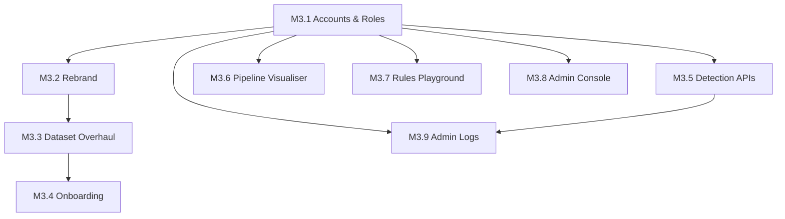

# Milestone 3 — ClaimCPU v3.0

> **Rebrand:** The application is renamed from "Claims Rule Engine" to **ClaimCPU**.
>
> **Scope:** This milestone transitions ClaimCPU from an internal analysis tool to a client-facing product with role-based access, company-scoped data, onboarding, detection APIs, and pipeline visualisation.
>
> **Key Concept:** The **company entity** becomes the primary data ownership unit. Trees, datasets, rules, and all business data are scoped to companies, not individual users.

---

## M3.1 — Accounts & Roles

Foundational track. Introduces role-based access control (RBAC) for multi-tenant usage. **Must be completed first** — all other tracks depend on the role system.

### M3.1.1 — Company Entity & Role System
- **Company** as the primary data umbrella — all trees, datasets, rules scoped to company
- Three roles: **Admin**, **Client Admin**, **Client User**
- OTP-based authentication only (no self-registration, no passwords)
- Admin pre-registers client emails upon contract signing
- Admin capabilities:
  - Manage all companies, users, datasets, trees, and rules
  - Register new companies and client users
  - View all detection API usage and system logs
  - Access admin console
- Client Admin capabilities:
  - Manage users within their company (view, request new user slots)
  - Manage company's datasets and rules
  - Cannot create or delete trees
- Client User capabilities:
  - Work with company's datasets and rules
  - Access detection APIs for company data
  - Cannot manage users or create trees

### M3.1.2 — Account Management & Admin Console
- Admin dashboard with overview metrics (companies, users, datasets, trees)
- Company management: create, edit, deactivate companies
- User management: register users, assign roles, deactivate
- Admin activity logs: filterable audit trail of all admin actions
- Client Admin company user view
- RLS policy rewrite: `user_id`-based → `company_id`-based isolation

### M3.1.3 — UI Adaptations
- Role-aware sidebar navigation (admin sees "Users" section)
- Role-based route protection (middleware / guards)
- Per-role landing page (Admin → admin dashboard, Client → datasets)

---

## M3.2 — Product Rebrand

Minor but important. Rename the application to **ClaimCPU** across the codebase and UI.

### M3.2.1 — Rebrand to ClaimCPU
- Replace all "Claims Rule Engine" / "CMF" references with **ClaimCPU**
- Update page titles, sidebar logo, favicon, meta tags, and README
- New branding assets (logo, wordmark, colors if needed)
- Update any email templates or notification text

---

## M3.3 — Dataset Creation Overhaul

Decouple dataset creation from mandatory CSV upload. Introduce a lighter "column schema" mode.

### M3.3.1 — Column Schema Mode (No CSV Required)
- New dataset creation path: client selects columns from the dimension catalogue
- Column picker UI with search, categories (e.g. claimant info, financial, vehicle, medical)
- Creates a dataset "schema" record without any file upload
- Schema-only datasets can still be used for rule building and tree generation

### M3.3.2 — CSV Upload Mode (Enhanced)
- Keep existing CSV upload path via Edge Functions
- Improve upload UX:
  - Drag-and-drop zone
  - File validation (size limits, format checks)
  - Progress indicator during Edge Function processing
- Auto-detect columns from uploaded file and pre-map to dimensions

### M3.3.3 — Dataset Management Improvements
- Unified dataset list showing both schema-only and CSV-backed datasets
- Dataset status badges (Schema Only / Has Data / Processing)
- Ability to convert schema-only → CSV-backed dataset (upload later)
- Dataset duplication / template feature

---

## M3.4 — Client Onboarding

Depends on **M3.1** (roles) and **M3.3** (dataset creation) being complete. Guides new business clients through their first experience.

### M3.4.1 — Onboarding Wizard
- Multi-step onboarding after first login:
  1. **Welcome** — product overview, value proposition
  2. **Company Profile** — company name, country, insurance type (Motor/Medical)
  3. **Column Selection** — select which claim columns their data contains (uses the column schema mode from M3.3.1)
  4. **Quick Tour** — interactive walkthrough of key pages (datasets, trees, rules, pipeline)
- Persist onboarding completion flag per user
- "Skip Tour" option with ability to revisit from settings
- Progress indicators (step dots / progress bar)

### M3.4.2 — First-Run Experience
- Sample/demo dataset to explore immediately
- Pre-built example tree and rule set for guided learning
- Contextual tooltips on first visit to each page

---

## M3.5 — Detection APIs

Expose tree-based scoring and rule-based flagging as HTTP APIs via Supabase Edge Functions. Order-independent after M3.1.

### M3.5.1 — Single Claim Detection API
- `POST /functions/v1/detect-claim`
- Input: JSON with claim data fields + tree ID(s) + rule set ID
- Output: JSON with score, probability, risk level, matched rules, trace path
- JWT-authenticated, scoped to user's own trees/rules

### M3.5.2 — Batch Detection API
- `POST /functions/v1/detect-claims-batch`
- Input: JSON array of claims + tree ID(s) + rule set ID
- Output: JSON array of detection results + summary statistics
- Rate limiting and size limits (e.g., max 500 claims per request)
- Async option for large batches (returns job ID, poll for results)

### M3.5.3 — API Documentation & Key Management
- Auto-generated API docs page within ClaimCPU
- API key generation and management (per client)
- Usage tracking (requests/day, total claims processed)
- Rate limit display and quota management

---

## M3.6 — Pipeline Visualiser

A new page that shows the end-to-end flow of claims through rules and then trees for a given dataset. Order-independent after M3.1.

### M3.6.1 — Pipeline Page Layout
- Dataset selector (choose which dataset to visualise)
- Two-stage flow diagram: **Rules Stage → Trees Stage**
- Summary cards at each stage showing claim counts and breakdown

### M3.6.2 — Rules Stage Visualisation
- Show all claims entering the rules engine
- Breakdown by rule: how many claims each rule flagged
- Severity distribution (Critical / High / Medium / Low)
- Claims that passed all rules vs. claims flagged by at least one rule
- Drill-down: click a rule → see the claims it flagged

### M3.6.3 — Trees Stage Visualisation
- Show claims flowing into the tree scoring engine
- Distribution of risk levels (Low / Moderate / High)
- Score histogram or distribution chart
- Per-tree breakdown: which trees contributed to scoring
- Drill-down: click a risk band → see the claims in it

### M3.6.4 — Combined Pipeline Summary
- Total claims processed
- Claims flagged by rules only, trees only, both, or neither
- Final risk classification breakdown
- Export results (CSV / JSON)

---

## M3.7 — Rules Playground

A dedicated page for interactive rule testing against individual claims — analogous to the existing tree visualisation playground. Order-independent after M3.1.

### M3.7.1 — Rules Playground Page
- Select a rule set (or individual rules) from existing persisted rules
- Input a claim via form or JSON editor
- Execute rules against the claim in real-time
- Display results: matched rules, severity, conditions met/failed

### M3.7.2 — Visual Rule Feedback
- Rule-by-rule result cards showing pass/fail status
- Condition-level detail (which field, operator, expected vs. actual value)
- Severity color coding consistent with the rest of the app
- Side-by-side: claim input on left, rule results on right

### M3.7.3 — Rules Playground Enhancements
- Bulk test: paste CSV or JSON array → evaluate all against rules
- Compare results across different rule sets
- Rule hit-rate statistics from bulk testing

---

## M3.8 — Admin Console

A dedicated admin-only area for provisioning and managing companies and user accounts. Depends on **M3.1** (role system must exist first).

### M3.8.1 — Admin Dashboard
- Overview cards: total companies, total users, total datasets, total trees, total API calls
- Recent activity feed (latest user registrations, dataset uploads, company changes)
- Quick-action buttons: "New Company", "Register User"
- System health indicators (Edge Function status, storage usage)

### M3.8.2 — Company Provisioning
- **Create Company** form: name, country, insurance type (Motor/Medical), max user slots
- Company list view: name, country, type, active users / max slots, status, created date
- Company detail page:
  - Edit company info
  - View all users under this company
  - View all datasets, trees, and rules belonging to company
  - Deactivate / reactivate company
- Company search and filtering

### M3.8.3 — User Provisioning
- **Register User** form: email, full name, select company (dropdown), select role (Client Admin / Client User)
- Triggers `supabase.auth.admin.createUser()` with pre-set role metadata
- User list view: name, email, company, role, status, last login
- Deactivate / reactivate user toggle
- Edit user role or reassign to different company
- Handle Client Admin slot-increase requests

---

## M3.9 — Admin Logs & Query Dashboard

Admin-only logs viewer and analytics dashboard. Provides full visibility into platform usage — what queries were run, by whom, against which data. Depends on **M3.1** + **M3.5** (Detection APIs generate the query logs).

### M3.9.1 — Query Logs Table
- Logs every detection API call (single and batch)
- Log fields: timestamp, user, company, query type (single/batch), tree(s) used, rule set used, claim count, result summary
- Stored in a dedicated `api_query_logs` table
- Filterable by:
  - **Company** — see all queries from a specific client
  - **Query type** — single claim vs. batch
  - **Date range** — time-based filtering
  - **User** — who ran the query
- Sortable columns, pagination
- Expandable row to view full query input/output (JSON)

### M3.9.2 — Company Query Dashboard
- Per-company analytics view:
  - Total queries (all time, last 30 days, last 7 days)
  - Queries by type breakdown (pie chart: single vs. batch)
  - Claims processed over time (line chart)
  - Most-used trees and rule sets
  - Peak usage times (heatmap or bar chart)
- Company selector dropdown at top
- Date range picker for all charts

### M3.9.3 — System-Wide Analytics
- Aggregated view across all companies:
  - Total platform queries and claims processed
  - Top companies by query volume
  - Query volume trends over time
  - Error rate and failed queries
- Export logs to CSV

### M3.9.4 — Admin Activity Audit Trail
- Logs all admin-level actions (not just API queries):
  - User created/deactivated
  - Company created/modified/deactivated
  - Tree created/deleted/assigned
  - Role changes
- Filterable by action type, admin user, target entity
- Immutable append-only log (cannot be deleted)

---

## Execution Order

| Order | Track | Depends On | Notes |
|-------|-------|------------|-------|
| **1st** | M3.1 — Accounts & Roles | — | Foundational, everything depends on it |
| **2nd** | M3.2 — Rebrand | M3.1 | Quick win, establishes new identity |
| **3rd** | M3.3 — Dataset Overhaul | M3.2 | Column schema mode needed for onboarding |
| **4th** | M3.4 — Onboarding | M3.1 + M3.3 | Requires roles and column selection |
| **Early** | M3.8 — Admin Console | M3.1 | Needed to provision companies and users |
| **Any** | M3.5 — Detection APIs | M3.1 | Independent after roles |
| **Any** | M3.6 — Pipeline Visualiser | M3.1 | Independent after roles |
| **Any** | M3.7 — Rules Playground | M3.1 | Independent after roles |
| **After M3.5** | M3.9 — Admin Logs & Dashboard | M3.1 + M3.5 | Needs API calls to generate query logs |

---

## Technical Notes

- **n8n Status:** Fully disconnected. All dataset processing uses Edge Functions (`process-dataset-upload`, `ai-column-alignment`, `calculate-dataset-quality`, `regenerate-aligned-dataset`) and Google Cloud Run services (`DataPreview`, `ArabicCheck`). Only legacy type names (`N8nAlignmentResponse`) remain as aliases.
- **Existing Rule Builder:** 3-panel layout (FieldPalette, LogicCanvas, OperatorsPanel) with auto-save — this powers rule creation. The Rules Playground (M3.7) is a separate *testing/evaluation* page.
- **Existing Pages:** auth, datasets, generate-tree, review-trees, rule-builder, rule-manager, table-visualizer, tree-visualizer, visualize-trace.

---

_Created: 2026-02-16 | Milestone 3 Planning_
